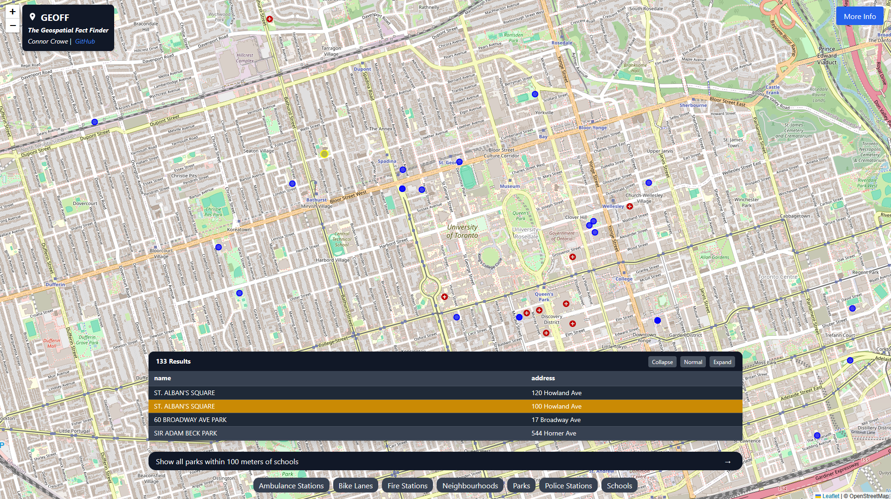

# Geoff: The GEOspatial Fact Finder

Ask a question, get a map. A natural language interface for querying geospatial data.

**[🌐 Try Geoff Here! 🌎](https://geoff.connorcrowe.ca)**
---

---
> 📘 **Latest: Version 0.3.1 - Query Builder Enhancement**
>
> **Recent Changes:**
> - **Aggregations & Analytics**: Full GROUP BY support with all major aggregation functions (COUNT, SUM, AVG, MIN, MAX, STDDEV)
> - **Advanced SQL Features**: CTEs (WITH clauses), subqueries, UNION operations, computed columns, and comprehensive WHERE operators (BETWEEN, IN, IS NULL)
> - **Spatial Calculations**: ST_Area, ST_Length, ST_Centroid, ST_Perimeter in SELECT clauses
> - **Sorting & Pagination**: ORDER BY and LIMIT for top-N queries
>
> See the full [CHANGELOG](docs/CHANGELOG.md) for details.
---
### Motivation
***How many questions can be answered with a map?*** Questions from urban mobility to planning to climate response and more can be answered with geospatial data, but can require complex spatial SQL queries and data cleaning that is non-trivial for non-technical users.

Geoff takes a prompt in natural language, converts it into a spatial SQL query, and displays the result on a map - shortening the time from question to insight for planners, geographers, and more.

**Problem Statement**: *Planners, NGOs, activists, public employees and more have questions with geospatial answers but are often limited by the collection and querying of spatial data.*

---

### Features

- **Natural Language Queries:** Ask questions in plain English and get answers mapped to real geospatial data.  
- **Dynamic Schema Selection:** Question is compared to vector descriptions of relevant datasets, ensuring efficient and accurate queries.  
- **Few-Shot Prompt Generation:** Builds system prompts with cached examples to improve generation and reduce errors.   
- **Interactive Frontend:** React + Tailwind interface with:
  - Prompt bar for natural language input  
  - Table view of query results  
  - Interactive map layer displaying queried geometries  
  - Dynamic data dictionary to see available search criteria
- **ETL Pipeline:** Automated ingestion, cleaning, and transformation of multiple datasets, with an easy path to add more.
- **Extensible Dataset Support:** Current version supports 10 datasets; architecture allows seamless addition of new sources.

|   |   |
| - | - |
| Dynamic data dictionary   |  | 
| Explorable results        |  |

**Note:** Geoff can only answer questions using data from its current datasets. Query capabilities are expanding with each release.

### Architecture

**Supported Query Types:**
- **Basic Queries**: Single and multi-layer selection with filtering
  - *"Show fire stations built after 1980"*
  - *"Show parks and schools"*
- **Spatial Operations**: Distance-based filters, intersections, spatial joins
  - *"Show bike lanes within 100m of schools"*
  - *"Show each school and its nearest fire station"*
- **Attribute Joins**: Join datasets based on shared attributes
  - *"Show the ward that Allan Gardens is in"*
- **Aggregations & Analytics**: GROUP BY with aggregation functions
  - *"Count schools per neighbourhood"*
  - *"Show total parking lot area within each ward"*
- **Advanced SQL**: CTEs, subqueries, UNION operations, computed columns
  - *"Show the 5 longest bike lanes"*
  - *"Merge all emergency service locations into one layer"*

**Coming Soon:**
- **`create`**: Geometry generation (buffers, centroids)
- **`route`**: Custom pathfinding and routing

For detailed specifications, see [`docs/specs/query_builder.md`](docs/specs/query_builder.md).

**Application Architecture**

**Tech Stack**
- Database
    - `Docker`, `PostGIS`, `PostgreSQL`, `pgvector`, `Python`, `SQL`
- Backend
    - `FastAPI`, `Ollama` (local LLMs), `OpenAI`, `Python`, `geoalchemy`, `sqlalchemy`
- Frontend 
    - `React`, `Tailwind CSS`, `Vite`, `Leaflet.js`, `OpenStreetMap`, `Node.js`
- Deployment & Infrastructure
    - `Docker`, `Nginx` (server & reverse proxy), Cloud VPS, VPN Tunnel

### Datasets

Currently includes 10 Toronto datasets with spatial and attribute data. The in-app data dictionary provides complete, up-to-date schema information.

**Available Datasets:**
- Ambulance/EMS Stations
- Attractions / Points of Interest
- Bike Lanes
- Fire Stations
- Neighbourhoods
- Parking Lots
- Parks
- Police Stations
- Schools
- Wards

See [`docs/tech/data_schema.md`](docs/tech/data_schema.md) for detailed schema information.

### Documentation

Documentation is available in the [`docs/`](docs/) directory:

- **[Current State](docs/current_state.md)**: What's implemented, in progress, and planned
- **[Vision](docs/vision.md)**: Long-term goals and aspirational capabilities
- **[Roadmap](docs/roadmap.md)**: Prioritized feature development plan
- **[Changelog](docs/CHANGELOG.md)**: Detailed version history

**Technical Documentation:**
- **[Architecture](docs/tech/architecture.md)**: System design and data flow
- **[Modules](docs/tech/modules.md)**: Detailed module specifications
- **[Data Schema](docs/tech/data_schema.md)**: Database structure and datasets
- **[Query Builder Spec](docs/specs/query_builder.md)**: SQL generation capabilities
- **[JSON Plan Spec](docs/specs/json_plan.md)**: LLM output format

**Use Cases:**
- **[Mobility Planning](docs/use_cases/1_mobility.md)**
- **[Commercial Real Estate](docs/use_cases/2_cre.md)**

### Roadmap

**🔜 Next:**
- **Layer History**: Previous query results panel with visibility controls
- **Geometry Creation**: Buffers, centroids, and synthetic geometry generation
- **Layer References**: Reference previous layers in new queries

**🎯 Future:**
- **Place Resolution**: Better handling of place name ambiguity and hierarchies
- **Transparency**: Query explanations, clarification questions, SQL visibility
- **User Feedback**: Thumb up/down with automated improvement loop
- **Workspaces**: Multi-layer management and export capabilities

See [`docs/roadmap.md`](docs/roadmap.md) for detailed feature descriptions.

### Contributing
*Suggestions & feedback are currently welcome. Open contribution is not currently available.*
If Geoff could help you or your organization, please reach out.

### Getting Started
*Instructions on setting up Geoff locally for custom use or additional data access will be available in the future.* Reach out if this is a priority for you.

### Attribution
Datasets currently used by Geoff are sourced from:
- [**Toronto Open Data**](https://open.toronto.ca/)
    
