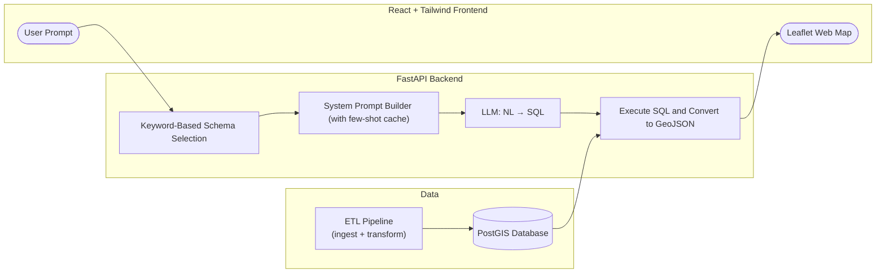

# Geoff: The GEOspatial Fact Finder
Ask a question, get a map. A natural language interface for querying geospatial data.

### Motivation
***How many questions can be answered with a map?*** Questions from urban mobility to planning to climate response and more can be answered with geospatial data, but can require complex spatial SQL queries and data cleaning that is non-trivial for non-technical users.

Geoff takes a prompt in natural language, converts it into a spatial SQL query, and displays the result on a map - shortening the time from question to insight for planners, geographers, and more.

**Problem Statement**

*Planners, NGOs, activists, public employees and more have questions with geospatial answers but are often limited by the collection and querying of spatial data.*

### Features

- **Natural Language Queries:** Ask questions in plain English and get answers mapped to real geospatial data.  
- **Dynamic Schema Selection:** Automatically matches keywords in queries to relevant datasets, ensuring efficient and accurate queries.  
- **Few-Shot Prompt Generation:** Builds system prompts with cached examples to improve LLM SQL generation and reduce errors.  
- **SQL Generation & Execution:** Converts user questions into SQL, executes queries on PostGIS, and retries intelligently if needed.  
- **GeoJSON Conversion:** Geospatial results are returned in a format ready for visualization.  
- **Interactive Frontend:** React + Tailwind interface with:
  - Prompt bar for natural language input  
  - Table view of query results  
  - Interactive map layer displaying queried geometries  
  - User interaction (click rows to highlight map features)  
- **ETL Pipeline:** Automated ingestion, cleaning, and transformation of multiple datasets, with an easy path to add more.  
- **Extensible Dataset Support:** Current version supports 5 datasets; architecture allows seamless addition of new sources.  

**Limits**
- Model can still be inconsistent at times
- Model needs more few-shot examples dealing with multiple tables
- Model needs more training on spatial-SQL specific functions

### Architecture

**Tech Stack**
- Database
    - Docker, PostGIS, PostgreSQL, Python, SQL
- Backend
    - FastAPI, Ollama (local LLMs), Python
- Frontend 
    - React, Tailwind CSS, Vite, Leaflet.js, OpenStreetMap, Node.js

### Datasets
The `More Info` section of the application has a dynamically generated data dictionary that will likely be more up to date than this section.

More datasets will be added in the future. Since the backend dynamically selects tables to send to the LLM, the only cost of increasing the number of datasets is more storage space. 
- EMS Stations
- Bike lanes
- Fire Stations
- Parks
- Police Stations
- Schools

### Roadmap
- ✅ Current: working ETL + backend + LLM + frontend
- 🔜 Next: improved model, additional datasets
- 🎯 Future: hosted demo, open contributions

### Contributing
*Suggestions & feedback are currently welcome. Open contribution is not currently available.*
If Geoff could help you or your organization, please reach out.

### Getting Started
*Instructions on setting up Geoff locally for custom use or additional data access will be available in the future.*

### Attribution
Datasets currently used by Geoff are sourced from:
- [**Toronto Open Data**](https://open.toronto.ca/)
    - *EMS Stations, Fire Stations, Bike lanes, Parks, Police Stations, Schools*
    