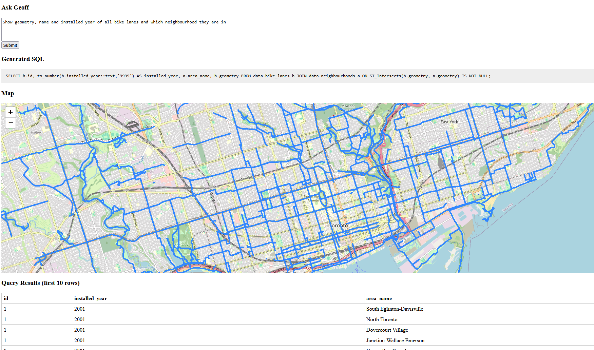

# Geoff: Natural language interface for exploring spatial data
###### *Connor Crowe*
**GEOFF *(GEO-spatial Fact Finder)*** takes a prompt in natural language, converts it into a spatial SQL query, and displays the result on a map - shortening the time from question to insight for planners, geographers, and more.

## Problem Statement
**Motivation**

*Many questions can be answered with a map.* Questions from urban mobility to planning to climate response and more can be answered with geospatial data, but can require complex spatial SQL queries and data cleaning that is non-trivial for non-technical users.

Geoff is an experiment in making answers more accessible by turning plain English into spatial queries and mapping the results.

**Problem**

Planners, NGOs, activists, public employees have questions with geospatial answers but are often limited by the collection and querying of spatial data.

## Current
### State of Development
- **DB**: Created via 2 docker containers, including full ETL pipeline to ingest and load data from API. Currently includes datasets on bike lanes, neighbourhoods, and parks.
- **Backend**: Prototype setup with `FastAPI` that can accept queries from the frontend, call the LLM to get a SQL query back, and return the results of that query to the frontend.
- **Frontend**: Can accept a natural language prompt, and display results on a map as well as in a preview table.
- **LLM**: Running local model `sqlcoder` via `Ollama` on home-lab. Results are... mixed.

- **Next Objectives**:
    - Auto-retry if SQL from LLM is not valid and executable
    - Add few-shot examples to system prompt to help LLM understand geospatial functions (intersections, buffers, areas & other aggregates, etc.)
    - Experiment with other models
    - Add prompt pre-processing to avoid needing to pass entire DB schema to LLM as system prompt
    - Improve visualization of results

**Status**: DB structure is done and expandable. The frontend is showing results! Now to improve the model reliability and add more data.

### Capabilities
**Currently Integrated Data**
- Bike lanes in Toronto (type of lane, year installed)
- Neighbourhoods in Toronto
- Parks and Recreation facilities

**Current Ability**
- Manual spatial queries on data (cleaned and joined)
- Mid-accuracy spatial SQL generated from English prompt
    - Models in experimentation: `mistral`, `mixtral`, `sqlcoder`, `llama3.2`

### Architecture
1. User enters a natural language question
2. Python backend prompts a local LLM (Mistral, SQLCoder)
3. LLM generates a PostGIS query against a local database
4. Query is run and results are visualized on a web map

**Tech Stack**
- Python
- PostGIS & PostgreSQL
- `Ollama` (local LLMs)
- Leaflet.js
- FastAPI
- Docker

### Limits
- Model is inconsistent
- Does not validate SQL before attempting execution
- Model doesn't fully understand spatial functions
- Model occasionally adds requirements not asked for

## Future
**Future Data**
- All streets and sidewalks (OSM)
- Transit stops
- Zoning
- Trees
- Water
- Population density
- Demographics

**Future Ability**
- Model improvements:
    - Further system prompting
    - Experimentation with other models
        - Including further SQL tuned models
    - Custom fine-tuning on spatial SQL
    - Post-processing
        - Automatic syntax validation
        - Schema-aware validation
    - Stretch: Few-shot cache
    - Stretch: Retrieval layer
    - Stretch: Learning from user feedback/flags
- Visualization
    - Explore results via map (hover, clickthrough, etc.)
