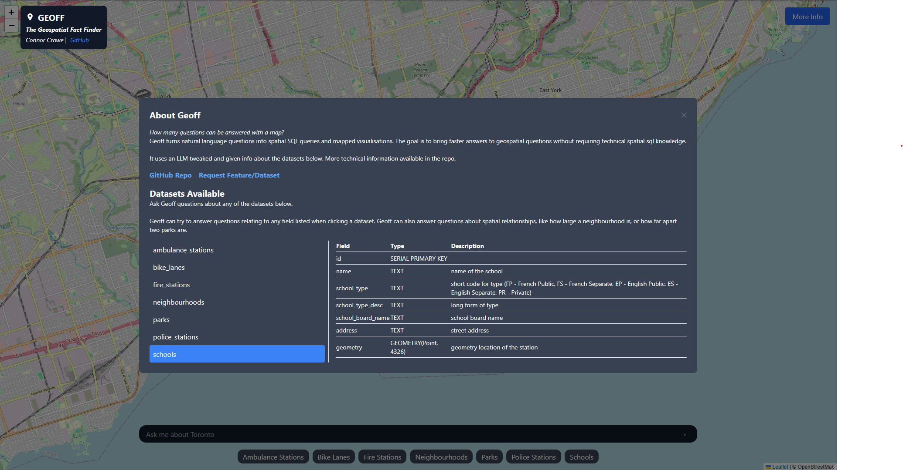
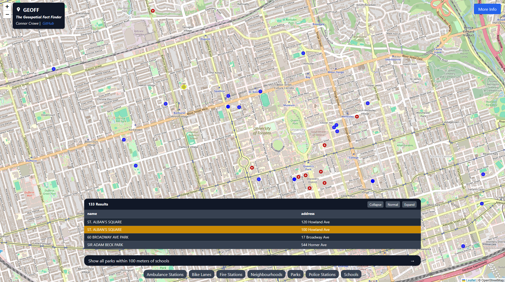
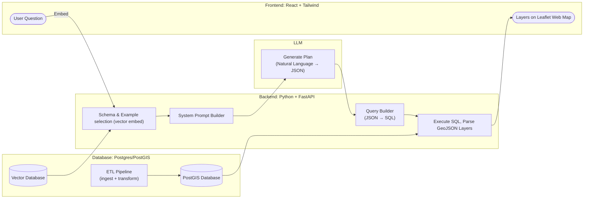

# Geoff: The GEOspatial Fact Finder
Ask a question, get a map. A natural language interface for querying geospatial data.

**[🌐 Try Geoff Here! 🌎](https://geoff.connorcrowe.ca)**
---

---
> 📘 Latest
>
> **Geoff 0.2** is alive!
> - **Multiple geometry layers** at once!
> - **New JSON Plan Architecture**: Huge under the hood change. Instead of LLM generating SQL directly (inconsistently), the LLM now generates structure JSON plans and a new query builder interprets them into spatial SQL. Much more deterministic, much more reliable - although functionality is now added one structure at a time.
>   - See ***Supported Question Types*** below for more
> - **Vector embedded examples & schemas**: the descriptions of the datasets and the examples the LLM has to pull from are now in a vector database, so the question can easily be compared to them and only the most relevant info pulled in.
---
### Motivation
***How many questions can be answered with a map?*** Questions from urban mobility to planning to climate response and more can be answered with geospatial data, but can require complex spatial SQL queries and data cleaning that is non-trivial for non-technical users.

Geoff takes a prompt in natural language, converts it into a spatial SQL query, and displays the result on a map - shortening the time from question to insight for planners, geographers, and more.

**Problem Statement**: *Planners, NGOs, activists, public employees and more have questions with geospatial answers but are often limited by the collection and querying of spatial data.*

---

### Features

- **Natural Language Queries:** Ask questions in plain English and get answers mapped to real geospatial data.  
- **Dynamic Schema Selection:** Question is compared to vector descriptions of relevant datasets, ensuring efficient and accurate queries.  
- **Few-Shot Prompt Generation:** Builds system prompts with cached examples to improve generation and reduce errors.   
- **Interactive Frontend:** React + Tailwind interface with:
  - Prompt bar for natural language input  
  - Table view of query results  
  - Interactive map layer displaying queried geometries  
  - Dynamic data dictionary to see available search criteria
- **ETL Pipeline:** Automated ingestion, cleaning, and transformation of multiple datasets, with an easy path to add more.  
- **Extensible Dataset Support:** Current version supports 9 datasets; architecture allows seamless addition of new sources. 

|   |   |
| - | - |
| Dynamic data dictionary   |  | 
| Explorable results        |  |

**Limits**
- ***Geoff can only answer questions about things it has in its datasets!***
- With new JSON plan architecture, Geoff can only answer questions that the query builder has been built for.

### Architecture
**Supported Question Types**
**`select`**
- **`select/1.0` Single layer**
    - E.g. *"Show fire stations built after 1980"*
- **`select/2.0` Multi-layer**
    - Returning multiple, unrelated geometries
    - E.g. *"Show me parks and schools*
- **`select/2.1.1` Spatial Filter**
    - Using one geometry to filter another (showing both) (distance, intersects)
    - E.g. *"Show bike lanes within 100 m of schools"*
- **`select/2.1.2` Spatial Join**
    - Joining two layers based on geometry (distance, intersects)
    - E.g. "*Show each school and the address of its nearest fire station"*
- **`select/2.2.1` Attribute Filter**
    - Filter one layer based on the attribute of another, joined by an attribute
    - E.g "*Show the ward that Allan Gardens is in"*
- **`select/2.2.2` Attribute Join**
    - Join two layers by attribute
    - E.g. *"Join attractions with wards by matching ward_id"*

**`aggregate`**
- *Coming imminently*

**`create`**
- *Coming soon*

**`route`**
- *Planned*

**Application Architecture**

**Tech Stack**
- Database
    - `Docker`, `PostGIS`, `PostgreSQL`, `pgvector`, `Python`, `SQL`
- Backend
    - `FastAPI`, `Ollama` (local LLMs), `OpenAI`, `Python`, `geoalchemy`, `sqlalchemy`
- Frontend 
    - `React`, `Tailwind CSS`, `Vite`, `Leaflet.js`, `OpenStreetMap`, `Node.js`
- Deployment & Infrastructure
    - `Docker`, `Nginx` (server & reverse proxy), Cloud VPS, VPN Tunnel

### Datasets
The `More Info` section of the application has a dynamically generated data dictionary that will likely be more up to date than this section.

More datasets will be added in the future. Since the backend dynamically selects tables to send to the LLM, the only cost of increasing the number of datasets is more storage space. 
- Ambulance/EMS Stations
- Attractions / Points of Interest
- Bike lanes
- Fire Stations
- Parking Lots
- Parks
- Police Stations
- Schools
- Wards

### Roadmap
- ✅ **Current:**
    - ***Support Question Types***
        - `aggregate` - Aggregated results and derived spatial features. 
    - ***More Datasets***
    - ***Automated JSON validation***

- 🔜 **Next:** 
    - ***Support Question Types***
        - `create` - "LLM Generated" geometry 
        - `route` - custom pathfinding 
    - ***Place Hierarchy table***
        - Better disambiguate between overlapping locations (E.g. "UofT" vs "University (Neighbourhood)" vs "University-Rosedale (Ward)" vs "Downtown" (Region), etc.) 
    - ***User Feedback Pool***
        - Add thumb up/down to each response. Add automated review of negatives. Use positives and corrections to negatives to continue building embedded vector example pool

- 🎯 **Future:**
    - ***Transparency & Reliability***
        - LLM justifications
        - Plan/SQL visibility
        - User added context / clarification
    - ***Workspaces***
        - Store multiple old layers, toggle visibility
        - Reference previous layers in new questions
    - ***QOL***
        - Export Results (csv, geojson)
        - Sort/filter results
        - Open contributions, local setup instructions

### Contributing
*Suggestions & feedback are currently welcome. Open contribution is not currently available.*
If Geoff could help you or your organization, please reach out.

### Getting Started
*Instructions on setting up Geoff locally for custom use or additional data access will be available in the future.*

### Attribution
Datasets currently used by Geoff are sourced from:
- [**Toronto Open Data**](https://open.toronto.ca/)
    