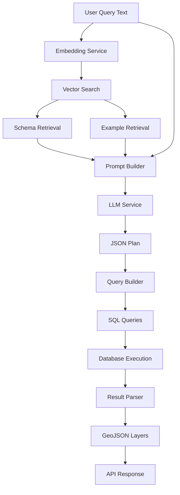

# Architecture

**Purpose: System components, interactions, data flow, deployment context. No implementation details.**

## System Overview

This is a natural language to spatial SQL system that converts user questions into PostGIS queries using retrieval-augmented generation (RAG). The system enables users to query geospatial datasets through natural language instead of writing SQL directly.

## Core Components

### 1. API Layer
- **FastAPI REST API** (`backend/api/routes.py`)
  - POST `/query` - Main endpoint for natural language queries
  - GET `/examples` - Retrieves example queries from metadata
  - GET `/schemas` - Retrieves database schema information

### 2. Query Service
- **Orchestration Layer** (`backend/services/query_service.py`)
  - Coordinates the entire query pipeline
  - Manages logging and request tracking
  - Handles retries and error recovery

### 3. Vector Search System
- **Embedding Service** (`backend/utils/embed.py`)
  - OpenAI text-embedding-3-small model
  - Generates 1536-dimension vectors from text
  
- **Vector Database** (`backend/db/vector_db.py`)
  - PostgreSQL with `pgvector` extension
  - Two embedding stores:
    - `meta.schema_embeddings` - Table/column descriptions
    - `meta.example_embeddings` - Example query/plan pairs
  - Uses cosine similarity for retrieval

### 4. LLM Integration
- **Prompt Builder** (`backend/core/prompt_builder.py`)
  - Formats schema information as text
  - Structures example queries for few-shot learning
  
- **LLM Service** (`backend/core/llm.py`)
  - OpenAI GPT-4o-mini model
  - Generates structured JSON execution plans
  - Temperature set to 0 for deterministic output

### 5. Query Generation
- **Query Builder** (`backend/core/query_builder.py`)
  - Converts JSON plans to PostGIS SQL
  - Supports SELECT, AGGREGATE, UNION, and CTE query types
  - Handles spatial/attribute joins, filters, grouping, and ordering
  - Implements table disambiguation for joins (requires explicit table prefixes in JSON plan)
  - Handles geometry conversion to GeoJSON via ST_AsGeoJSON()

### 6. Data Layer
- **Database Service** (`backend/db/db.py`)
  - PostgreSQL connection pool
  - PostGIS for spatial operations
  - Returns results as dictionaries
  
- **Result Parser** (`backend/core/parse_results.py`)
  - Executes generated SQL queries
  - Converts results to GeoJSON FeatureCollections
  - Separates geometry from properties
  - Organizes output as "layers" for map visualization

## Data Flow

## Control Flow

1. **Request Reception**
   - User submits natural language query via POST `/query`
   - Request ID generated for logging/tracking

2. **Context Retrieval** (RAG)
   - Query text converted to embedding vector
   - Vector similarity search against schema embeddings
   - Vector similarity search against example embeddings
   - Filters results by similarity threshold (-0.3)

3. **Prompt Construction**
   - Relevant table schemas formatted as text
   - Top N example queries formatted as few-shot examples
   - System prompt instructs LLM to generate JSON plan

4. **Plan Generation**
   - LLM receives user query + schema context + examples
   - Generates structured JSON execution plan
   - Plan specifies: action, tables, columns, filters, relations

5. **SQL Generation**
   - JSON plan parsed and validated
   - Query builder converts plan to PostGIS SQL
   - Supports SELECT, AGGREGATE, UNION, and CTE query types
   - Handles spatial operations (ST_DWithin, ST_Intersects, ST_Contains, ST_Within)
   - Handles attribute and spatial joins (INNER, LEFT, RIGHT, FULL)
   - Supports filters with multiple operators and logical combinations
   - Implements GROUP BY with aggregate functions (SUM, COUNT, AVG, MIN, MAX, STDDEV)
   - Table disambiguation enforced via explicit prefixes in JSON plan

6. **Execution & Parsing**
   - SQL queries executed against PostgreSQL
   - Results converted to GeoJSON format
   - Multiple queries become multiple "layers"
   - Each layer contains: name, features, properties, tabular data

7. **Response Delivery**
   - Layers returned to client as JSON
   - Client can render on map (geometry) and table (properties)

## Key Design Patterns

### Retrieval-Augmented Generation (RAG)
- Embeddings store domain knowledge (schema, examples)
- Vector search retrieves relevant context dynamically
- LLM receives only pertinent information for each query
- Reduces hallucination and improves accuracy

### Two-Stage Generation
1. Natural language → JSON plan (LLM)
2. JSON plan → SQL (deterministic code)
- Separates reasoning from syntax generation
- Enables validation and modification of plans
- Provides structure for complex spatial queries

### Layer-Based Results
- Each SQL query becomes a separate layer
- Supports multi-dataset visualizations
- Enables progressive rendering
- Separates spatial and tabular views

## Technology Stack

- **API Framework**: FastAPI
- **Database**: PostgreSQL 15+ with PostGIS and `pgvector`
- **Embeddings**: OpenAI text-embedding-3-small
- **LLM**: OpenAI GPT-4o-mini
- **Language**: Python 3.11+
- **Spatial**: PostGIS (ST_DWithin, ST_Intersects, ST_AsGeoJSON)

## Deployment Architecture

The system runs as containerized services (see docker-compose files):

- **Backend Service**: FastAPI application server
- **Database Service**: PostgreSQL with PostGIS + `pgvector`
- **ETL Service**: Periodic data ingestion and embedding generation
- **Frontend Service**: Web client for user interaction

## Integration Points

### External Services
- **OpenAI API**: Embeddings and LLM generation
- **Data Sources**: Toronto Open Data Portal (via CKAN API)

### Internal Services
- Backend ↔ Database: PostgreSQL protocol
- Frontend ↔ Backend: REST API (JSON)
- ETL ↔ Database: Direct SQL connection

## Scalability Considerations

- Vector search performance depends on embedding index
- LLM calls are synchronous (potential bottleneck)
- Database connection pooling for concurrent requests
- Embedding cache reduces OpenAI API costs
- Example store grows with usage (requires maintenance)